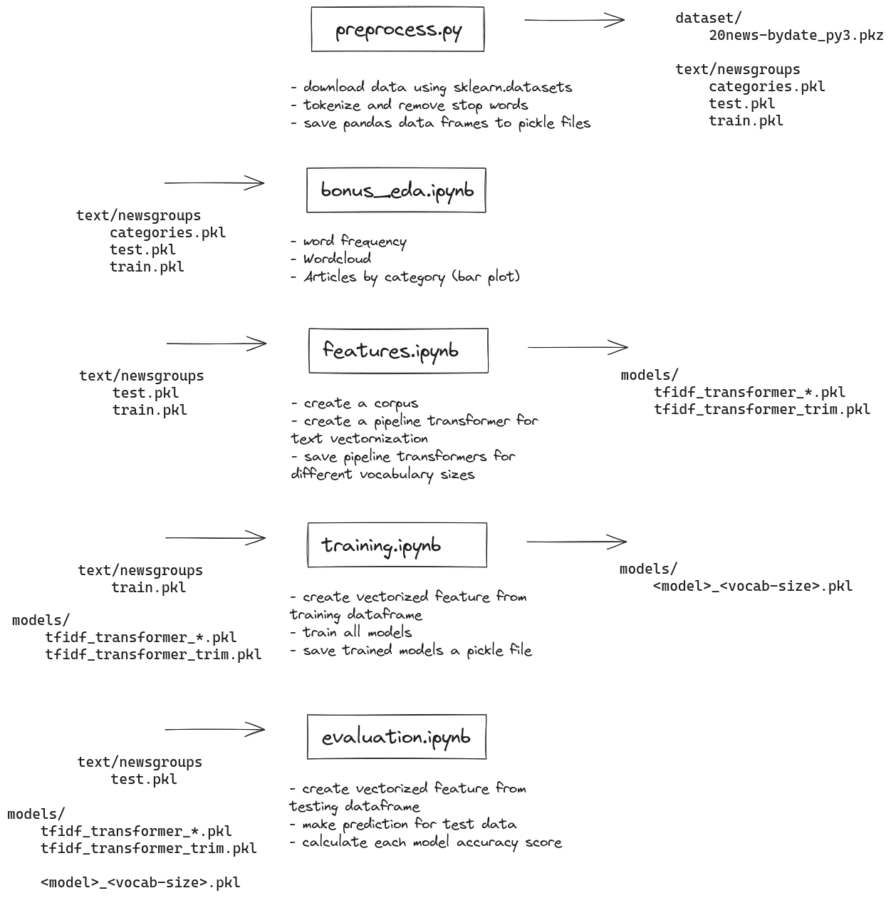

# Text classification

Text classification project for the newsgroups dataset comprises around 18000 newsgroups posts on 20 topics.

## About the dataset

https://scikit-learn.org/stable/datasets/real_world.html#the-20-newsgroups-text-dataset

A dictionary-like structure with following keys:

- data: 11314 items, type 'str'
- filenames: 11314 items, type 'numpy.str_'
- target_names: 20 items, 'str'
- target: 11314 items, 'numpy.int64'
- DESCR: type: 'str'

> items count is based on the 'training' subset

# Procedure Overview

# Summary and Analysis

In my text classification project, I began by thoroughly preprocessing the 20 Newsgroups dataset. My strategy was straightforward: clean the text data, tokenize it, and remove all stopwords. This preparation was essential, leading to a streamlined set of data ready for the machine learning models to come. I used TF-IDF vectorization to engineer features, working with vocabularies of varying sizes, like 25,000, 50,000, and 100,000 terms.

As I trained the models, I discovered that the LinearSVC model was best, achieving an accuracy of about 0.69 with the 100,000 term vocabulary and training in just under 3 seconds. This was in a big distinction to the MLPClassifier, which had a good but lower accuracy and took significantly longer, approximately 7,339 seconds, to train on the same feature set.

The value of a comprehensive EDA became clear to me later in the project. It revealed frequent terms such as "think" and "people" that dominated the dataset, along with the uneven distribution of articles across the categories. These insights suggested areas for improvement in preprocessing and highlighted the importance of class balance for effective model training.

Moving forward, I see a path laid out for refinement. I plan to adjust the preprocessing phase to diminish the influence of overly common terms. Balancing the dataset to represent all categories more equitably could help improve model performance. Additionally, I might consider integrating more sophisticated vectorization methods like word embeddings.

Reflecting on the project, I recognize that the outcomes were solid, but there's room for enhancement. The numbers from the EDA have provided a clearer direction for these improvements.